# ChoNaBojo

> _"Cho na bojo"_ — Polish slang for _"let's go to the pitch"_.

**ChoNaBojo is a mobile app that helps recreational athletes find people to play with at sports venues in their own neighbourhood.**

You have a free afternoon and a sport in mind, but your friends can't fill the roster — and driving across the city for a game isn't worth the commute. Generic social media groups and chat threads rarely help. ChoNaBojo anchors matchmaking to **specific local venues**, the places where games actually happen, so that proximity, sport and timing converge into one actionable "let's go play".

---

## Table of contents

- [What the app does](#what-the-app-does)
- [The key user journey (North Star)](#the-key-user-journey-north-star)
- [More screens](#more-screens)
- [Tech stack](#tech-stack)
- [Repository layout](#repository-layout)
- [The `context/` directory — how this app was built with an AI agent](#the-context-directory--how-this-app-was-built-with-an-ai-agent)
- [Want to test the app?](#want-to-test-the-app)
- [Running it locally](#running-it-locally)
- [MVP scope and non-goals](#mvp-scope-and-non-goals)

---

## What the app does

| Capability | Details |
| --- | --- |
| **Account & session** | Register with e-mail + password and at least one contact method (phone, e-mail or messenger handle — you choose which to share). The session survives app restarts. |
| **Venue map** | A map centred on your current location showing sports venues from a curated database (Warsaw for the MVP). Pan and zoom — the viewport *is* the proximity boundary. Manual address entry is the fallback when location permission is denied. |
| **Sport filter** | Optionally narrow the map to one discipline from a predefined list (football, basketball, volleyball, tennis, running, cycling, rollerblading, gym, street workout, swimming). All sports are shown by default. |
| **Event creation** | Create an event at a venue: title, description, sport, start, estimated end, participant limit (2–300) and optional auto-accept for join requests. |
| **Event discovery & join** | See which events are happening at a venue, how many spots are filled, and send a join request. Events past their estimated end time can no longer be joined. |
| **Approval & contact reveal** | The organiser accepts or rejects each request individually. **Contact details are revealed only after explicit acceptance** — never to unapproved requesters. |
| **Push notifications** | The organiser is notified about new join requests; the requester is notified about acceptance or rejection; participants are notified about cancellations and removals. |
| **Event lifecycle** | The organiser can cancel an event or remove a participant; a participant can leave an event. Events past their end time are auto-closed by a background worker. |

Privacy is the hard boundary of the product: **no contact data is ever visible to unauthenticated users or to people the organiser has not approved.**

---

## The key user journey (North Star)

The roadmap defines one **North Star** slice — *"organiser accepts a join request and both parties see each other's contact info"* (`S-05`). That is the moment the matchmaking loop closes and the product hypothesis is proven. Here is that journey end to end, with screenshots from `images/`.

### 1. Log in

Access is login-only — nothing about events, venues or people is visible to an anonymous user.

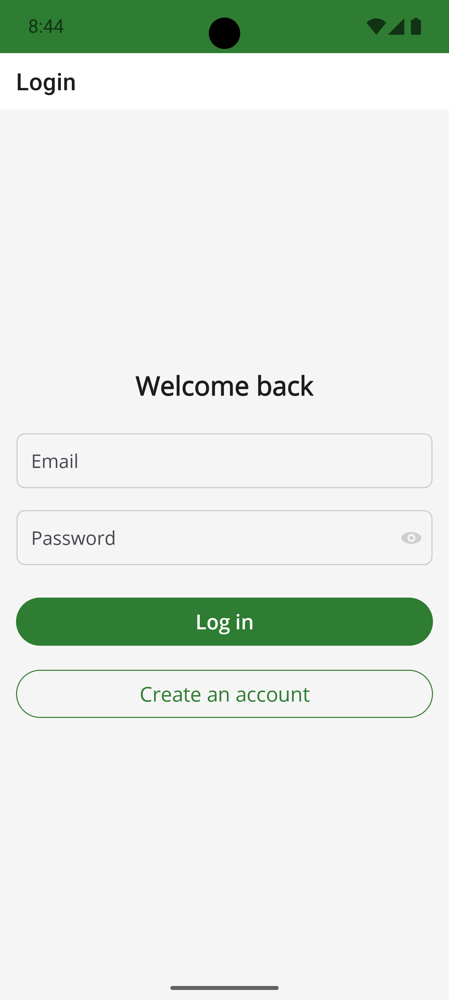

### 2. Find a venue near you

The map opens centred on your location and shows the venues around you. Pan and zoom to explore further; tap the sport chips to narrow the map to a single discipline.

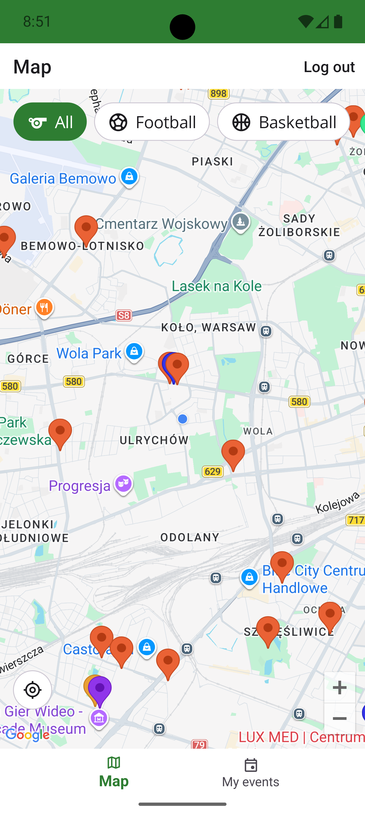 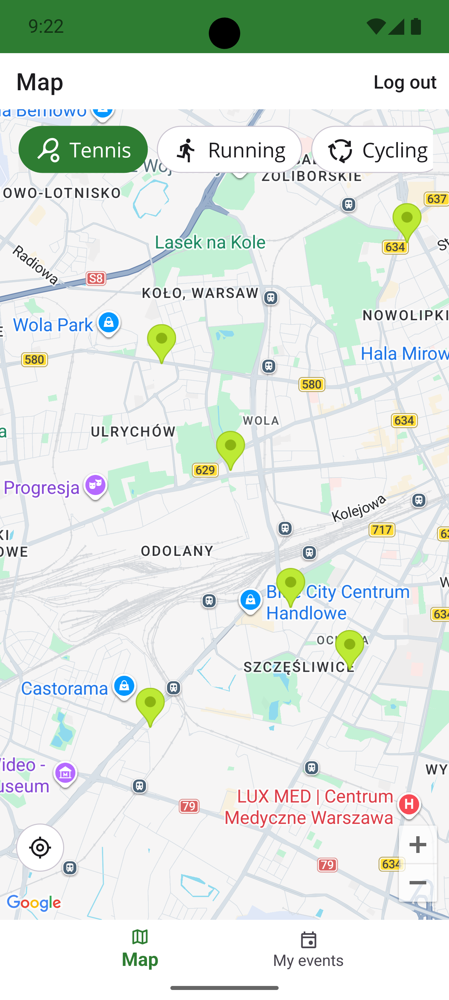

### 3. Create a game at that venue…

The organiser picks the venue, names the game, sets the sport, the start, the estimated end, the participant limit, and decides whether requests should be auto-accepted.

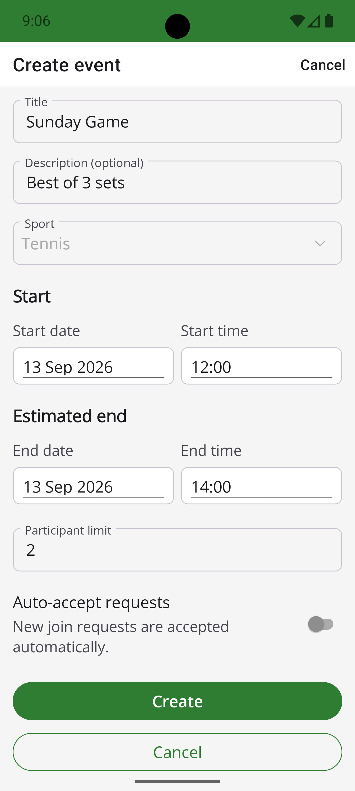 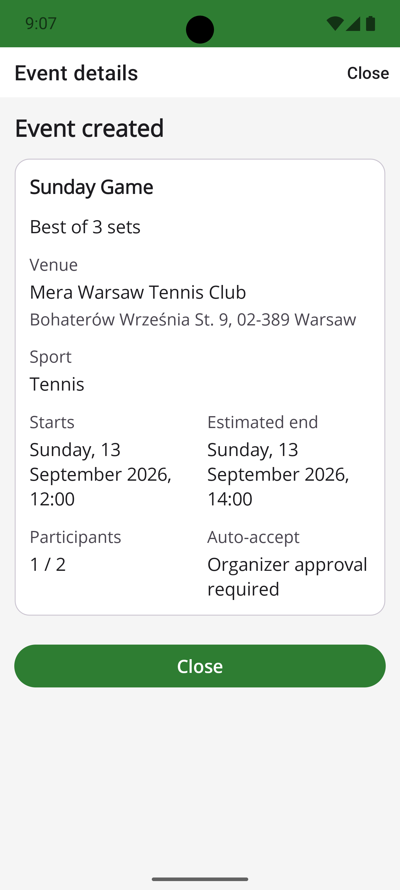

### 4. …or join someone else's

Tapping a venue lists its upcoming events with their fill state (`1 / 2`), so you never join blind. One tap sends a join request; the card then shows it as pending.

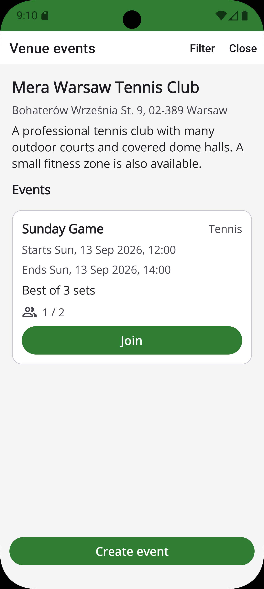 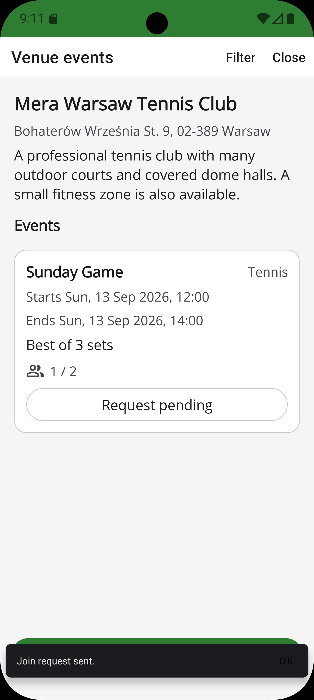

### 5. The organiser gets the request and decides

The organiser gets a **push notification** within seconds; the request also lands in **My events**, where the event card flags `1 pending request`. Until the organiser taps **Accept**, the requester's contact details stay locked — the card says so explicitly.

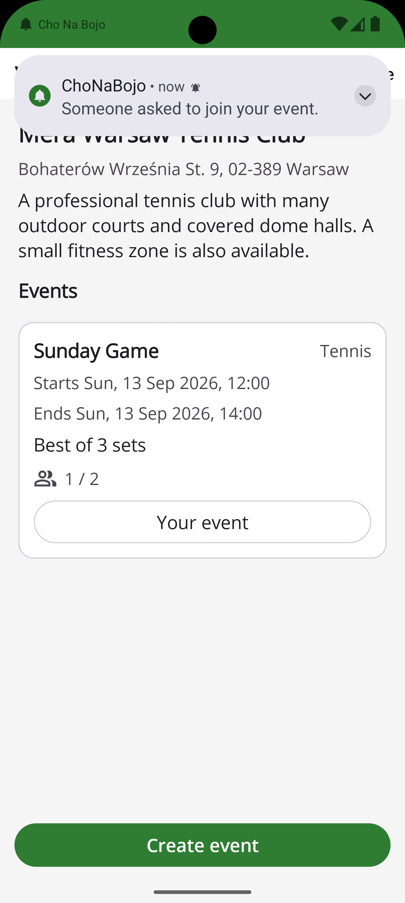 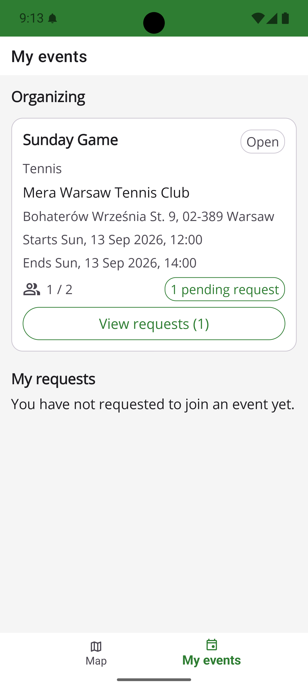 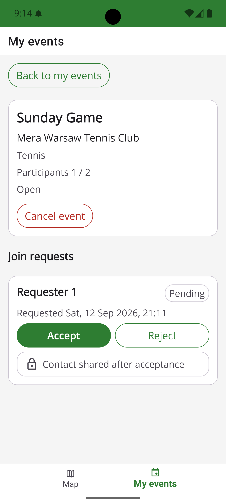

### 6. 🎯 Contact info is revealed — both ways

On acceptance the event fills up (`2 / 2`) and **both** sides see each other's chosen contact channels, with one-tap *Copy* / *Open* so they can move the conversation to phone, e-mail or messenger and settle the details.

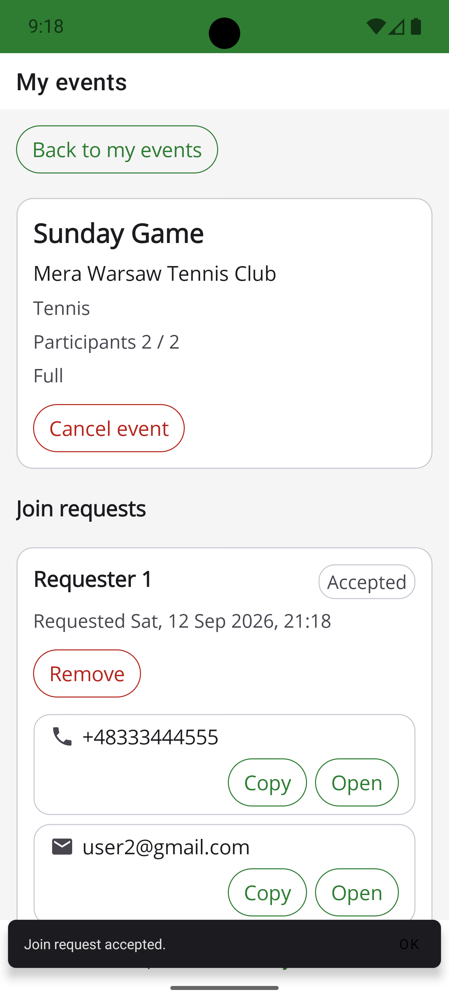 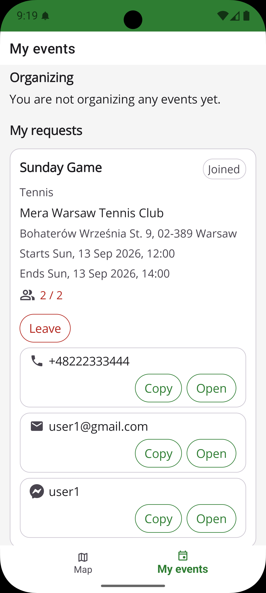

**That is the North Star:** a stranger in your neighbourhood is now a person you are playing tennis with on Sunday at 12:00.

---

## More screens

| Screenshot | What it shows |
| --- | --- |
| `images/VenueEventsPage_NoEventsHere.png` | An empty venue — nothing booked yet, so be the one who starts the game. |
| `images/VenueEventsPage_YourEvent.png` | Your own event in the venue listing — marked **Your event** instead of **Join**. |
| `images/VenueEventsPage_EventFull.png` | The same event once it is full (`2 / 2`) — no spots left. |
| `images/MyEventsPage_Organizer_ContactReveal.png` | The organiser's accepted request, with **Remove** and the participant's contacts. |
| `images/MyEventsPage_Participant_RequestPending.png` | Participant-side pending state, contact still hidden. |

---

## Tech stack

C# end to end:

- **Mobile client** — .NET MAUI, Android-only (Android 10+ / API 29+), Google Maps SDK for the map.
- **Backend** — ASP.NET Core Web API (`net10.0`), minimal APIs, JWT auth, background workers for push delivery and auto-closing past events.
- **Database** — PostgreSQL (Supabase), EF Core migrations, seeded sports and Warsaw venues.
- **Push** — Firebase Cloud Messaging (HTTP v1).
- **Delivery** — Railway for the API, GitHub Actions for CI/CD, Google Play internal app sharing for the Android build.

The production API is hosted on Railway at **https://cho-na-bojo-production.up.railway.app** — the Android release build talks to it by default (`app/ChoNaBojoApp/MauiProgram.cs`), and `GET /health` is its public liveness endpoint. The service runs continuously rather than scaling to zero, because the push-delivery and event-auto-close background workers have to keep processing on schedule.

Full reasoning behind these choices lives in [`context/foundation/tech-stack.md`](context/foundation/tech-stack.md) and [`context/foundation/infrastructure.md`](context/foundation/infrastructure.md).

---

## Repository layout

```
app/ChoNaBojoApp/   .NET MAUI mobile client (Android)
server/             ASP.NET Core Web API
shared/             Code shared between client and API
data/               Venue / sport seed data
solutions/          ChoNaBojo.slnx
images/             Screenshots used in this README
context/            All AI-agent context: PRD, roadmap, plans, reviews, lessons
```

---

## The `context/` directory — how this app was built with an AI agent

**Every context file used to work with the AI agent lives in [`context/`](context/).** This is not incidental documentation — it is the working memory of the project, and reading it tells you *why* the code looks the way it does:

- [`context/foundation/`](context/foundation/) — the durable product and technical foundation:
  - [`prd.md`](context/foundation/prd.md) — vision, personas, user stories, functional and non-functional requirements, access control, non-goals.
  - [`roadmap.md`](context/foundation/roadmap.md) — the work sliced into vertical, user-visible milestones (`F-01`…`S-07`) with the North Star called out explicitly.
  - [`tech-stack.md`](context/foundation/tech-stack.md), [`infrastructure.md`](context/foundation/infrastructure.md) — stack and deployment decisions.
  - [`shape-notes.md`](context/foundation/shape-notes.md), [`ui-guidelines.md`](context/foundation/ui-guidelines.md), [`lessons.md`](context/foundation/lessons.md) — discovery notes, UI conventions, and recurring rules harvested from past reviews.
- [`context/changes/`](context/changes/) — the folder for the change currently in flight (`change.md` → `plan.md` → implementation → review).
- [`context/archive/`](context/archive/) — one immutable folder per completed change, each keeping its identity note, plan, research and reviews. It is a complete audit trail of how the MVP was delivered, slice by slice.
- [`AGENTS.md`](AGENTS.md) — the onboarding document an AI agent reads first.

If you are an agent (or a human) picking this repository up: start with `context/foundation/prd.md` and `context/foundation/roadmap.md`, then read the archived change matching the area you are touching.

---

## Want to test the app?

The app is distributed through **Google Play internal app sharing**, which means access is granted per-tester.

**Please contact me first** — I have to add you to the list of authorised testers before the link will work for you.

Once you have been granted access, install the build from:

👉 **https://play.google.com/apps/test/com.cho_na_bojo/10081**

### You must enable "Internal app sharing" in the Play Store first

The link only opens if internal app sharing is turned on in the Google Play Store app on your device:

1. Open the **Google Play Store** app.
2. Tap the **profile icon** → **Settings**.
3. Expand **About** and tap the **Play Store version** seven times to unlock **Developer options**.
4. Go back to **Settings** → expand **General** → **Developer options** → turn on **Internal app sharing** and confirm with **Turn on**.
5. Now open the link above (on the device) and install the build.

The official instructions are in the section **"How authorised testers turn on internal app sharing"** of Google's help page:
https://support.google.com/googleplay/android-developer/answer/9844679?hl=en-GB

> Requirements: an Android device running **Android 10 (API 29) or newer**, and the Google account you gave me must be the one signed in to the Play Store.

---

## Running it locally

```powershell
dotnet build solutions/ChoNaBojo.slnx     # build everything
dotnet run --project server               # API on http://localhost:5100
dotnet build app/ChoNaBojoApp -f net10.0-android
```

Before the map or push notifications will work locally you need a Google Maps API key in `secrets/maps.props` and Firebase credentials in user-secrets — both are described in [`AGENTS.md`](AGENTS.md). Secrets never go into `appsettings.json` or into the repository.

A debug build points at the local API (`http://10.0.2.2:5100` from the Android emulator); a release build points at the hosted one (`https://cho-na-bojo-production.up.railway.app`), so you do not need to run the server yourself to use the published app.

---

## MVP scope and non-goals

Deliberately **out of scope** for the MVP (see `context/foundation/prd.md` → *Non-Goals*):

- No iOS build — Android only.
- No user-contributed venues — the venue database is curated and covers Warsaw only.
- No inviting specific people — discovery is open, the point is meeting new players.
- No ratings or reputation system.
- No in-app messaging — after acceptance you coordinate through your own contact channels.

### A note on the Windows build

The repository does contain a second delivery workflow, [`.github/workflows/windows-deploy.yml`](.github/workflows/windows-deploy.yml), which publishes and signs a Windows MSIX package of the MAUI app (`net10.0-windows10.0.19041.0`) together with a certificate and installation instructions for testers.

Treat it as a convenience for desktop smoke-testing only. **ChoNaBojo is designed exclusively for Android** — several of the features this product depends on do not work under Windows: the map (the Google Maps handler is Android-specific), push notifications (Firebase Cloud Messaging is wired up through the Android platform project), device location, and the mobile-first layout. A Windows run will therefore give you a partial, degraded app, not the product described above.

The Android build produced by [`.github/workflows/android-deploy.yml`](.github/workflows/android-deploy.yml) and shared via Google Play — see [Want to test the app?](#want-to-test-the-app) — is the only supported way to experience ChoNaBojo as intended.
